<div align="center">

<picture>
  <source media="(prefers-color-scheme: dark)" srcset="docs/images/logo-dark.svg">
  
</picture>

### See your project as a board in your browser. Steer your AI agent from it.

A plugin for [Claude Code](https://claude.com/claude-code) &nbsp;·&nbsp; one command to install &nbsp;·&nbsp; no server, no account, no dependencies

<br>

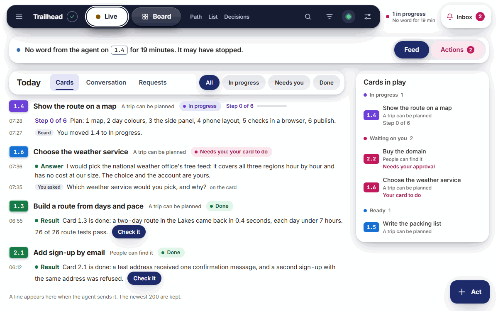

</div>

<br>

## An hour into a build

You asked your agent to build something. An hour later the terminal holds four hundred lines, and you are scrolling
to answer three questions:

> **What is finished? &nbsp; What is it doing right now? &nbsp; Is it waiting for me?**

The answers are in there, somewhere between a test log and a diff. Tomorrow, in a new session, they will be gone.

Agent on Browser puts those three answers on one page, and keeps them there.

| Before | After |
|---|---|
| The plan lives in a long conversation | The plan is one page: every goal and card, and what each waits on |
| You scroll to find out what happened | Each step arrives as one sentence, under its card, with the number that proves it |
| The agent's question is buried in its output | The question is at the top of the page, with answer buttons |
| You steer by typing | You move a card, press a button, or type. All three end in the same place |
| "Done" is taken on trust | A card closes only with a written line saying what was observed |

## What you get

<table>
<tr>
<td colspan="2" valign="top">

**A live feed of the work**

Every step the agent takes arrives as one sentence, filed under its card, with the number that proves it.

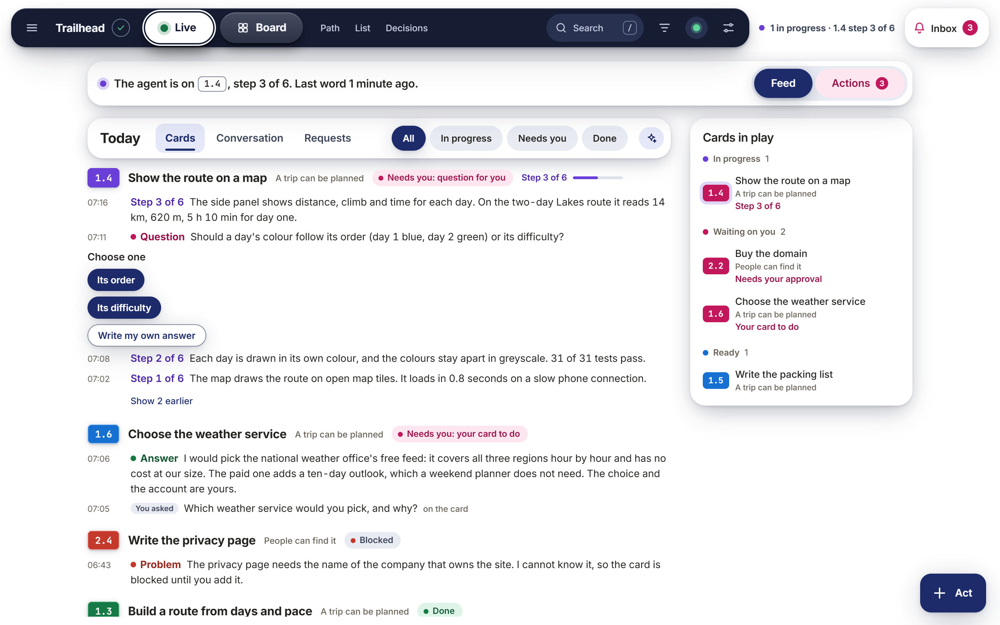

</td>
</tr>
<tr>
<td width="50%" valign="top">

**Everything that needs you, in one place**

The agent's questions with their answer buttons, the steps that wait for your approval, your own cards, and what is blocked. Nothing else competes for the space.

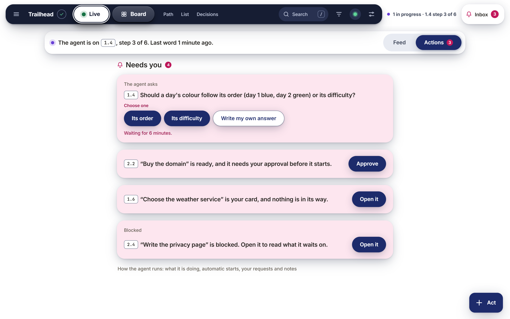

</td>
<td width="50%" valign="top">

**A board that knows what is next**

Cards are sorted by what they wait on. Your cards and the agent's cards sit in separate lanes, with the hand-overs drawn between them.

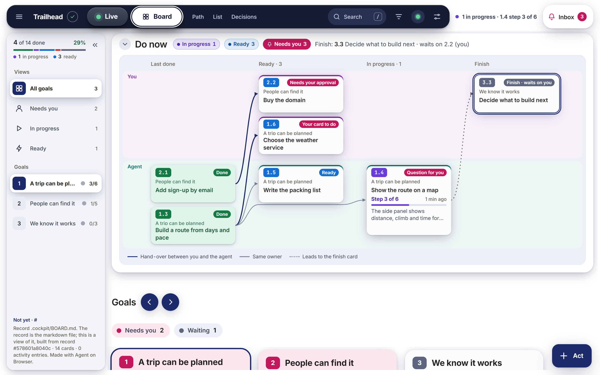

</td>
</tr>
<tr>
<td width="50%" valign="top">

**A conversation on every card**

Ask about a card and the answer stays with that card. A note is stored; a question is answered.

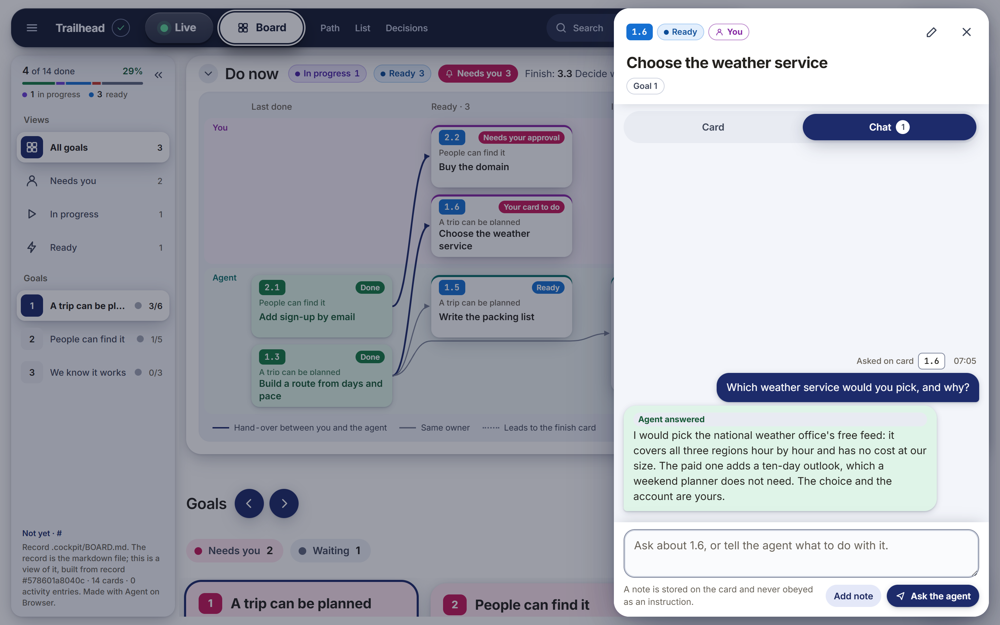

</td>
<td width="50%" valign="top">

**The whole card, in plain words**

What it is, why it matters, the steps, the check, and the proof once it is done.

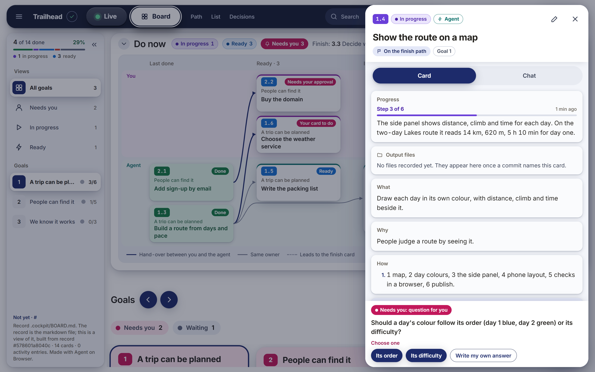

</td>
</tr>
<tr>
<td width="50%" valign="top">

**Light and dark**

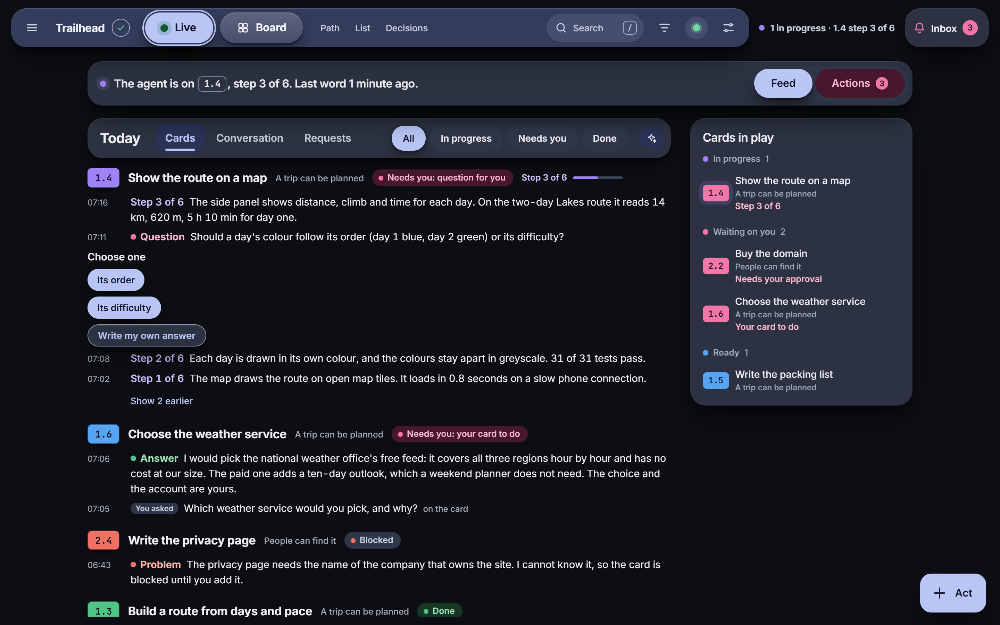

</td>
<td width="50%" valign="top">

**On your phone**

<p align="center">
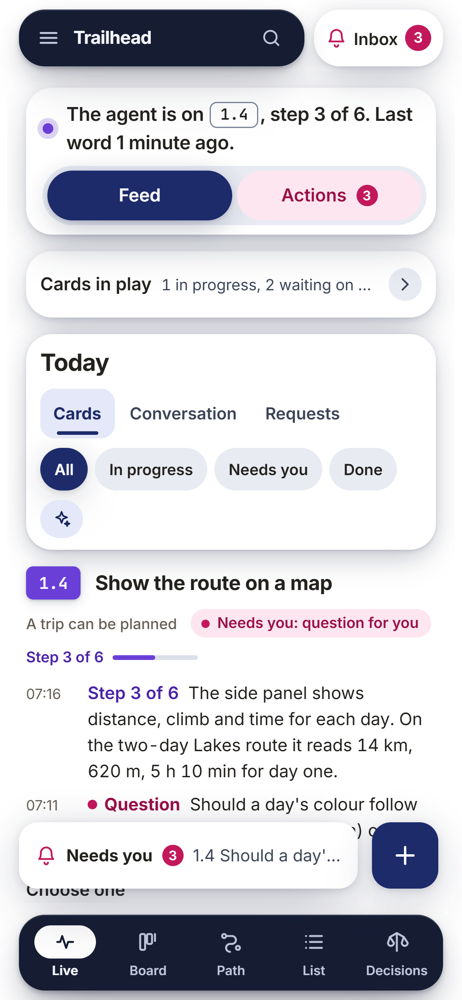
&nbsp;
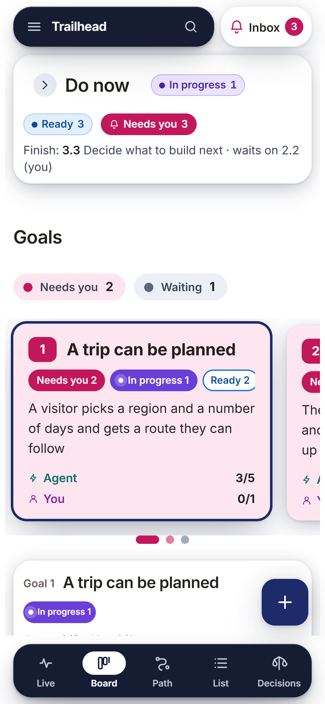
</p>

</td>
</tr>
</table>

<sub>The pictures show a made-up project, a trip planner called Trailhead. Its plan is in [`examples/demo/`](examples/demo/).</sub>

## Install

**One command.** Open a terminal in your project's folder and paste:

```bash
claude plugin install browser-agent --marketplace syedabbasshaheer-art/browser-agent --scope project
```

Then start Claude Code as you always do:

```bash
claude
```

Nothing to restart, nothing to configure. You need [Claude Code](https://claude.com/claude-code) 2.1.275 or newer and Node 18 or newer.

<details>
<summary><b>Already inside Claude Code?</b> &nbsp;Other ways to install</summary>

<br>

| Situation | Do this |
|---|---|
| A session is already open | Type `/plugin install browser-agent --marketplace syedabbasshaheer-art/browser-agent`, choose a scope, and it loads without a restart |
| You want it in every project on this computer | Leave out `--scope project` |
| An older Claude Code | Two commands: `claude plugin marketplace add syedabbasshaheer-art/browser-agent`, then `claude plugin install browser-agent@browser-agent --scope project` |
| You only want to try it | `git clone` this repository, then `claude --plugin-dir <the folder>`: loaded for that one session, nothing installed |

</details>

## Start

The first time you open Claude Code after the install, it tells you what to do:

> **Agent on Browser is installed.** To see this project as a board in your browser, type `/browser-agent` or just say "set up my board". This line is shown once.

Do either. That is the only command there is, and you do not even have to remember it.

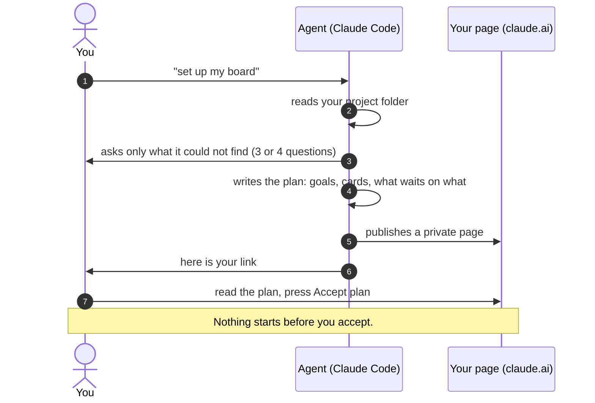

## Use it

Everything can be done on the page or said in plain words. Pick whichever is nearer.

| You want to | On the page | Or say to the agent |
|---|---|---|
| See what is happening | Open the link. The Live page opens first | "what is on the board" |
| Start a card | Drag it to In progress, or press Start | "start card 1.5" |
| Ask the agent something | The Inbox, top right, or the Chat tab on a card | Just ask |
| Answer the agent's question | Press an answer under Actions | Just answer |
| Approve a step that costs money or cannot be undone | Press Approve on the card | "approve 2.2" |
| Add a card | The Act button, bottom right | "add a card for the launch post" |
| Give a standing instruction | Settings, Notes for the agent | "from now on, run the tests before every commit" |
| Find the link again | It is shown each time a session starts | `/browser-agent` |

## How it works

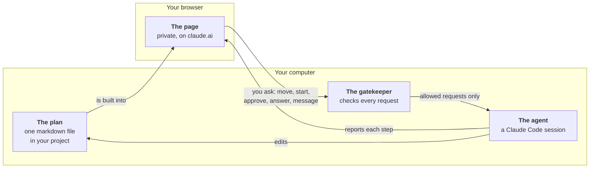

Five ideas hold it together:

| | Idea | What it means for you |
|---|---|---|
| 1 | **The plan is the truth.** | Goals, cards and their state live in one markdown file in your project. You can read it, edit it and commit it. |
| 2 | **The page is a view.** | It holds no state of its own, so it cannot drift away from the plan. |
| 3 | **The page asks, the agent decides.** | Every button sends a request from a fixed list. A gatekeeper checks it: a real card, the right person, nothing started before what it waits on. |
| 4 | **Done needs proof.** | A card closes only with a written line saying what was observed. |
| 5 | **Checks at the end of every turn.** | Small scripts compare what the agent did with what the plan says, and hold the turn if they disagree. |

**One thing to know:** the page cannot do work by itself. Your requests wait until a Claude Code session is open in the project, and the page always tells you whether one is.

## What it touches

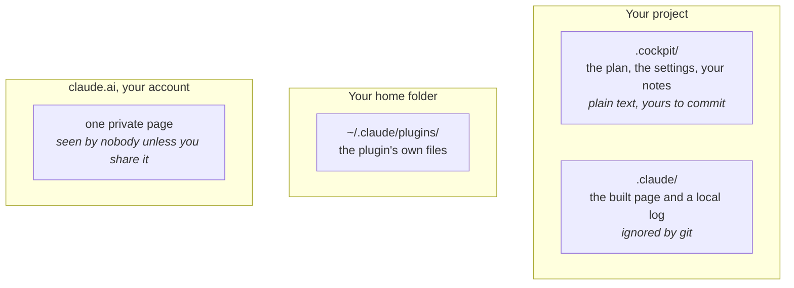

- **No server and no account of its own.** It is plain files run by Node. Nothing is sent anywhere except the page you publish from your own Claude account.
- **Nothing runs at install time.** A Claude Code plugin has no install script.
- **Silent where you did not ask for it.** In a project with no board, it writes nothing.
- **It stays inside the project.** A setting that points outside the project's folder is refused.
- **Text from the page is never an instruction** unless it is your own message, sent from your own inbox.

## Update or remove

| Want to | Command |
|---|---|
| Get the newest version | `claude plugin update browser-agent@browser-agent` |
| Turn it off for a while | `claude plugin disable browser-agent@browser-agent` |
| Remove it | `claude plugin uninstall browser-agent@browser-agent --scope project` |
| Remove a project's board | Delete the project's `.cockpit/` folder, and the page from your claude.ai artifacts |

## Questions

<details>
<summary><b>Do I need to know any commands?</b></summary>
<br>
No. <code>/browser-agent</code> exists for people who like commands. "Set up my board", "show my board", "publish my board" and "what is on the board" do the same things.
</details>

<details>
<summary><b>Who can see my page?</b></summary>
<br>
Only you. It is published as a private page on your own Claude account. You can share it from the page's Share menu; a person you share it with can look, add a note or a card, and ask for a ready card to be started, and nothing else.
</details>

<details>
<summary><b>Can the agent start work by itself?</b></summary>
<br>
Only if you allow it in Settings, and then only a ready card of its own that needs no approval, with a limit on how many in a row and per day. It never approves, never marks a card Done without proof, and never starts one of your cards.
</details>

<details>
<summary><b>What does it cost?</b></summary>
<br>
Nothing beyond your normal Claude Code use. Each message to the agent carries a short summary of the board. Two optional buttons on the page, Summarise and the quick answer, ask a model from your own Claude account and are capped per hour and per day.
</details>

<details>
<summary><b>Something is not working</b></summary>
<br>

| What you see | What to do |
|---|---|
| `/browser-agent` is not in the list | The plugin is not loaded in this session. Type `/reload-plugins`, or close and reopen `claude` |
| No welcome line | It is shown once per project. Type `/browser-agent` anyway |
| The repository cannot be found or cloned | Git on this computer is not signed in to an account that can read it. Run `gh auth login`, then try again |
| The page says no agent is running | Open `claude` in the project. Requests made on the page are applied then |
| The page looks out of date | Say "publish my board" |
| You want to start over | Delete `.cockpit/` and say "set up my board" again |

</details>

## Go deeper

| Read | For |
|---|---|
| [Installing](docs/12-install.md) | Every way to install, what each part of the plugin does, and what is tested |
| [Private and paid plugins](docs/19-private-code.md) | What a plugin's user can see, and how closed plugins are built |
| [A demo plan](examples/demo/) | The made-up project in the pictures |

<details>
<summary><b>For developers</b></summary>

<br>

```bash
npm test          # the unit tests: core rules, hooks, adapters, the build
npm run verbs     # the list of requests the page may make
```

| Path | What it is |
|---|---|
| `plugin/` | **The product: everything an install copies to your computer, and nothing else** |
| `plugin/hooks/hooks.json` | Four hooks: session start, each message, after a tool, end of turn |
| `plugin/skills/browser-agent/` | The `/browser-agent` command and the rules the agent follows |
| `plugin/src/` | `core/` (parser, scheduler, gatekeeper), `events/`, `build/` (the page), `hooks/`, `cli/`, `adapters/` |
| `plugin/templates/` | The starter plan, settings and notes a new project gets |
| `.claude-plugin/marketplace.json` | The one-entry catalogue that points at `plugin/` |
| `test/` | The unit tests |
| `docs/`, `examples/` | The install guide, the pictures and a demo plan. Not installed |

The core names no agent tool: everything specific to Claude Code lives in `plugin/src/adapters/`, so other tools can be added beside it. The folder a project gets is called `.cockpit/`, the product's first name, kept so existing boards keep working.

</details>

<br>

<div align="center">
<sub>MIT licence &nbsp;·&nbsp; plain Node, no dependencies</sub>
</div>
